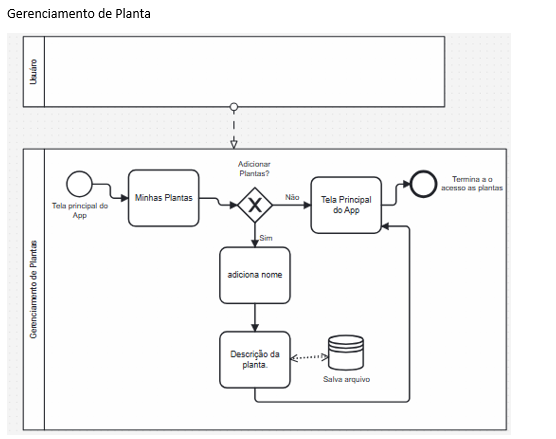
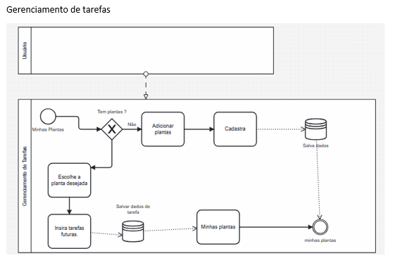
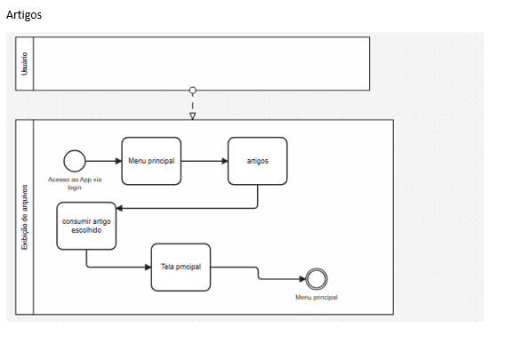
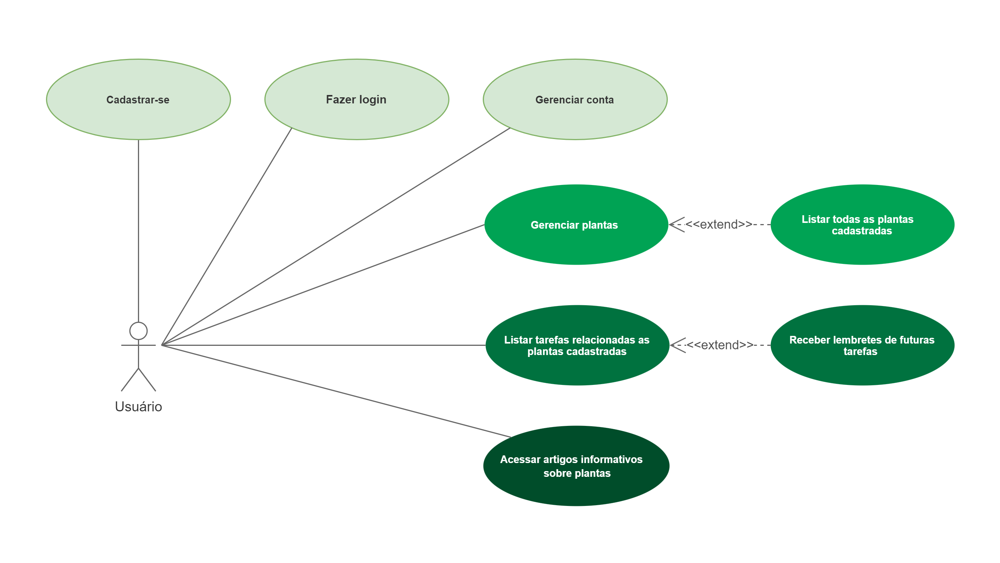
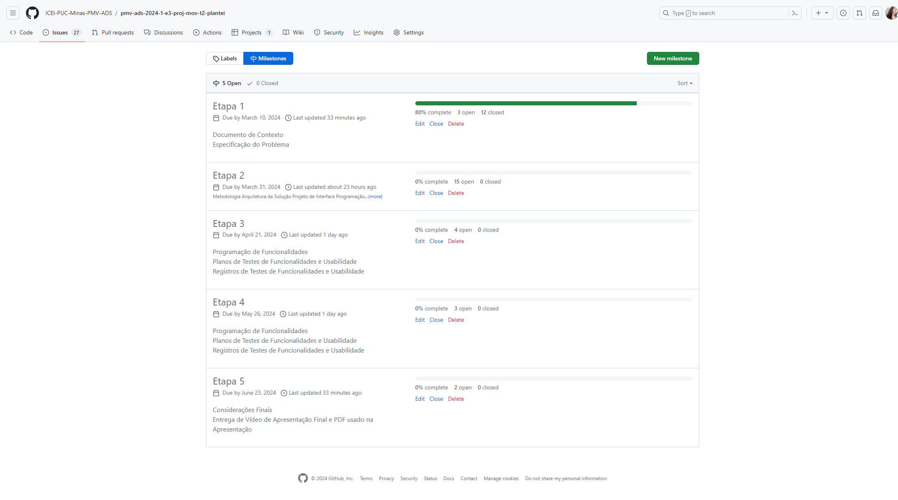
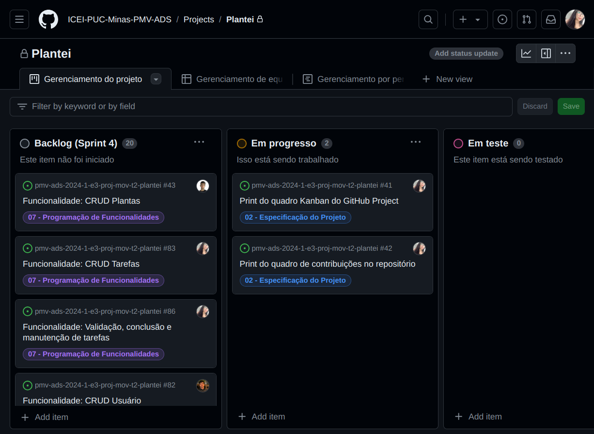
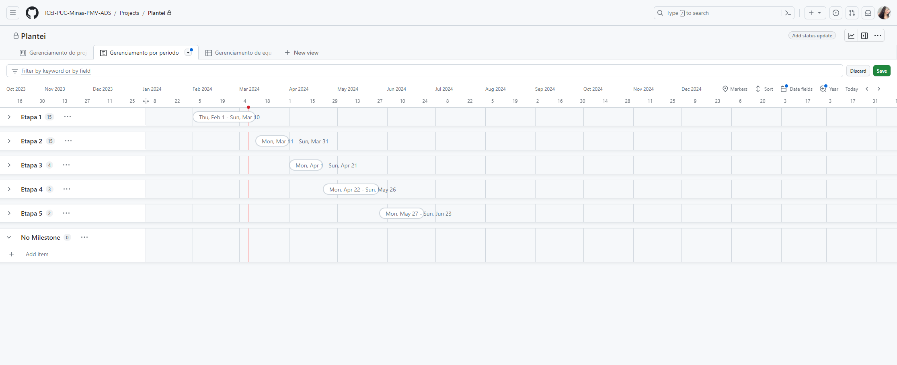
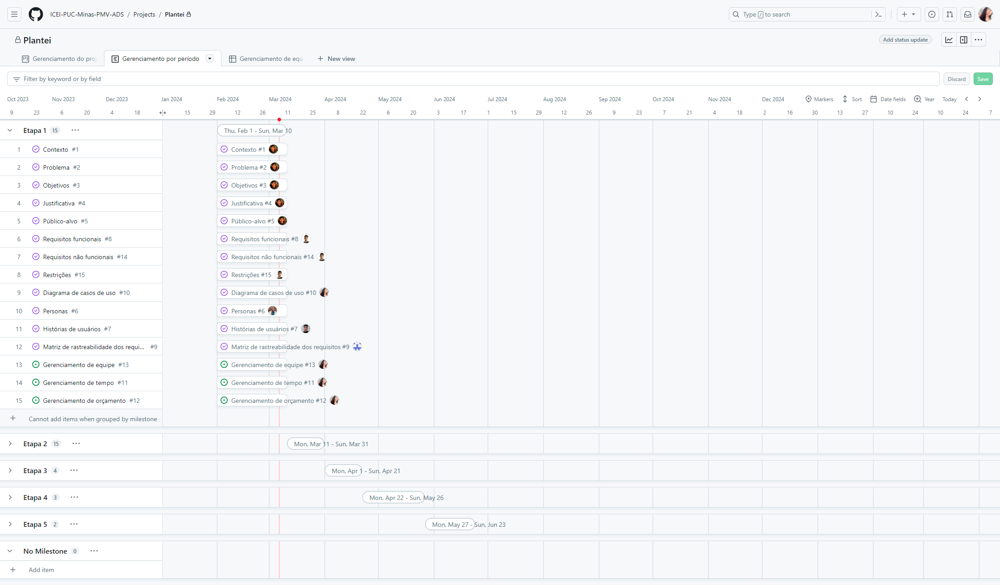
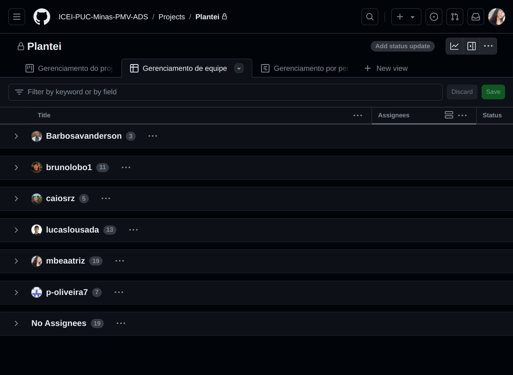

# Especificações do Projeto

<!-- Pré-requisitos: <a href="1-Documentação de Contexto.md"> Documentação de Contexto</a> -->

Definição do problema e ideia de solução a partir da perspectiva do usuário. É composta pela definição do  diagrama de personas, histórias de usuários, requisitos funcionais e não funcionais além das restrições do projeto.

<!-- Apresente uma visão geral do que será abordado nesta parte do documento, enumerando as técnicas e/ou ferramentas utilizadas para realizar a especificações do projeto -->

## Personas

## Histórias de Usuários

Com base na análise das personas forma identificadas as seguintes histórias de usuários:

|EU COMO... `PERSONA`| QUERO/PRECISO ... `FUNCIONALIDADE` |PARA ... `MOTIVO/VALOR`                 |
|--------------------|------------------------------------|----------------------------------------|
|usuário iniciante  | criar um perfil para minha planta    | receber orientações personalizadas sobre seus cuidados       |
|usuário avançado    | adicionar múltiplas plantas ao meu perfil      | gerenciar eficientemente o cuidado de todas as minhas plantas em um só lugar |
|usuário   | receber notificações personalizadas sobre o momento ideal para regar minha planta       | garantir que ela receba a quantidade adequada de água para prosperar      |
|usuário ocupado     | ajustar as configurações de lembretes    |adaptar o cuidado das plantas à minha rotina movimentada      |
|usuário curioso   |acessar dicas e tutoriais sobre o cuidado de plantas      |aprimorar minhas habilidades de jardinagem e entender as necessidades específicas de cada planta      |
|usuário preocupado com a privacidade    |controlar quem pode acessar minhas informações de planta     |garantir a confidencialidade dos dados relacionados às minhas plantas      |
|usuário experiente    |fornecer feedback sobre o estado da minha planta     |receber sugestões adicionais de cuidados e melhorias      |
|usuário consciente da água |informações sobre práticas de economia de água no cuidado das plantas |contribuir para a conservação de recursos hídricos |

## Modelagem do Processo de Negócio 

### Análise da Situação Atual

Este modelo tem como objetivo revolucionar o universo dos amantes de plantas. Através da aplicação do Modelo BPMN, apresentamos uma visão geral do projeto, mapeando seus principais processos e funcionalidades, com o intuito de proporcionar uma experiência completa e intuitiva para o usuário.

#### Processo 1 – Gerenciamento de usuário

#### Processo 2 – Processo de gerenciamento de Planta

#### Processo 3 - Gerenciameto de tarefas

#### Processo 4 - Verificação  de artigos

### Indicadores de desempenho para o Aplicativo de Gerenciamento de Plantas Domésticas

| Número | Indicador de Desempenho              | Descrição                                                                                             | Métrica        | Cálculo                       | Meta        | Perspectiva | Fonte de Dados | Periodicidade |
|--------|-------------------------------------|-------------------------------------------------------------------------------------------------------|----------------|-------------------------------|-------------|-------------|----------------|---------------|
| 1      | Taxa de Sobrevivência das Plantas   | Porcentagem de plantas registradas no aplicativo que sobrevivem por um período especificado.          | Porcentagem    | (Plantas sobreviventes / Total de plantas registradas) * 100 | >= 90%      | Manutenção e Saúde das Plantas | Banco de dados do aplicativo | Mensal        |
| 2      | Engajamento do Usuário              | Número médio de vezes que os usuários interagem com o aplicativo por semana.                           | Frequência     | (Total de interações / Total de usuários) / Semana | >= 3 vezes  | Satisfação do Usuário | Registro de interações do aplicativo | Semanal       |
| 3      | Feedback do Usuário                | Quantidade média de feedbacks recebidos dos usuários sobre a usabilidade e funcionalidades do aplicativo.| Quantidade     | Total de feedbacks recebidos / Número de meses | >= 5 por mês| Aperfeiçoamento do Aplicativo | Sistema de coleta de feedback | Mensal        |
| 4      | Crescimento do Banco de Dados      | Taxa mensal de crescimento do número de espécies de plantas e informações sobre elas no banco de dados. | Porcentagem    | ((Número atual de espécies - Número anterior de espécies) / Número anterior de espécies) * 100 | >= 5%       | Expansão de Conteúdo | Banco de dados do aplicativo | Mensal        |
| 5      | Tempo Médio de Resposta do Suporte | Tempo médio que a equipe de suporte leva para responder às consultas e solicitações dos usuários.       | Horas          | Total de horas de resposta / Total de consultas e solicitações | <= 24 horas| Eficiência Operacional | Registro de solicitações de suporte | Diária        |
| 6      | Taxa de Retenção de Usuários       | Porcentagem de usuários que retornam ao aplicativo após o primeiro uso dentro de um período específico. | Porcentagem    | (Usuários que retornam / Total de usuários que usaram pela primeira vez) * 100 | >= 60%      | Fidelização de Usuários | Registro de usuários | Mensal        |

## Requisitos

As tabelas que se seguem apresentam os requisitos funcionais e não funcionais que detalham o escopo do projeto.

### Requisitos Funcionais

|ID    | Descrição do Requisito  | Prioridade |
|------|-----------------------------------------|----|
|RF-001| A aplicação deve permitir que o usuário se cadastre, faça login, edite seu e-mail, senha e foto, apague sua conta e recupere sua senha. | ALTA | 
|RF-002| A aplicação deve permitir que o usuário adicione plantas de forma personalizada ou utilizando uma planta pré-cadastrada pelo sistema, além de poder editar e remover plantas. | ALTA |
|RF-003| A aplicação deve exibir informações gerais sobre as plantas pré-cadastradas no sistema, incluindo: nome, descrição, foto, frequência ideal de rega, fertilização e troca de vaso. | MÉDIA |
|RF-004| A aplicação deve disponibilizar para o usuário a opção de ativar ou desativar o recebimento de notificações de rega, fertilização e troca de vaso em um horário definido por ele. | ALTA |
|RF-005| A aplicação deve exibir todas as plantas adicionadas pelo usuário. | ALTA |
|RF-006| A aplicação deve exibir todas as futuras tarefas de cada planta adicionada pelo usuário. | ALTA |
|RF-007| A aplicação deve disponibilizar artigos variados sobre plantas. | BAIXA |

### Requisitos não Funcionais

|ID     | Descrição do Requisito  |Prioridade |
|-------|-------------------------|----|
|RNF-001| O sistema deve ser suportado em dispositivos iOS e Android | ALTA |
|RNF-002| O sistema deve ser responsivo para rodar em diferentes dispositivos móveis | MÉDIA |
|RNF-003| O sistema deve cumprir com a Lei Geral de Proteção de Dados (LGPD) | ALTA |
|RNF-004| O sistema deve atender aos critérios de acessibilidade | ALTA |
|RNF-005| O sistema deverá usar a tecnologia React Native em seu desenvolvimento | ALTA |
|RNF-006| O sistema deverá conter plantas pré-cadastradas no banco de dados | ALTA |
|RNF-007| O sistema deve possuir uma interface intuitiva e amigável para usuários de todas as idades e níveis de habilidade. | MÉDIA |

<!-- Com base nas Histórias de Usuário, enumere os requisitos da sua solução. Classifique esses requisitos em dois grupos:

- [Requisitos Funcionais
 (RF)](https://pt.wikipedia.org/wiki/Requisito_funcional):
 correspondem a uma funcionalidade que deve estar presente na
  plataforma (ex: cadastro de usuário).
- [Requisitos Não Funcionais
  (RNF)](https://pt.wikipedia.org/wiki/Requisito_n%C3%A3o_funcional):
  correspondem a uma característica técnica, seja de usabilidade,
  desempenho, confiabilidade, segurança ou outro (ex: suporte a
  dispositivos iOS e Android).
Lembre-se que cada requisito deve corresponder à uma e somente uma
característica alvo da sua solução. Além disso, certifique-se de que
todos os aspectos capturados nas Histórias de Usuário foram cobertos. -->

## Restrições

O projeto está restrito pelos itens apresentados na tabela a seguir.

|ID| Restrição                                             |
|--|-------------------------------------------------------|
|RE-001 | Não é permitido à equipe terceirizar o desenvolvimento do trabalho. |
|RE-002 | O projeto será entregue em cinco fases progressivas ao longo do semestre letivo, com marcos definidos para cada entrega parcial. |
|RE-003 | O projeto completo deverá ser entregue no final do semestre letivo. |

<!-- Enumere as restrições à sua solução. Lembre-se de que as restrições geralmente limitam a solução candidata.

> **Links Úteis**:
> - [O que são Requisitos Funcionais e Requisitos Não Funcionais?](https://codificar.com.br/requisitos-funcionais-nao-funcionais/)
> - [O que são requisitos funcionais e requisitos não funcionais?](https://analisederequisitos.com.br/requisitos-funcionais-e-requisitos-nao-funcionais-o-que-sao/) -->

## Diagrama de Casos de Uso

| ID     | Caso de uso  | Descrição | Requisito associado |
|-------|----|-------------------------|----|
|UC-001| Cadastrar-se | O usuário deve se cadastrar para utilizar o aplicativo. | RF-001 |
|UC-002| Fazer login | Ao se cadastrar, o usuário poderá fazer o login para utilizar o aplicativo. | RF-001 |
|UC-003| Gerenciar conta | Ao fazer login, o usuário poderá: editar seu email, sua senha e excluir sua conta. | RF-001 |
|UC-004| Gerenciar plantas | Ao fazer login, o usuário poderá: adicionar, editar, visualizar detalhes e excluir plantas. | RF-002 RF-003 |
|UC-005| Listar todas as plantas cadastradas | Quando o usuário possuir uma ou mais plantas cadastradas, poderá ser exibida uma lista delas. | RF-005 |
|UC-006| Listar tarefas relacionadas as plantas cadastradas | O usuário poderá visualizar uma lista com as futuras tarefas relacionadas às suas plantas cadastradas, sendo elas: regar, fertilizar e trocar o vaso. | RF-006 |
|UC-007| Receber lembretes de futuras tarefas | O usuário poderá ativar os lembretes, para que seja lembrado periodicamente sobre as tarefas relacionadas às suas plantas. | RF-004 |
|UC-008| Acessar artigos informativos sobre plantas | Ao fazer login, o usuário poderá acessar artigos informativos sobre plantas. | RF-007 |

## Matriz de Rastreabilidade

|  ID   | RF-001 | RF-002 | RF-003 | RF-004 | RF-005 | RF-006 | RF-007 | RNF-001 | RNF-002 | RNF-003 | RNF-004 | RNF-005 | RNF-006 | RNF-007 | UC-001 | UC-002 | UC-003 | UC-004 | UC-005 | UC-006 | UC-007 | UC-008 |
|-------|--------|--------|--------|--------|--------|--------|--------|---------|---------|---------|---------|---------|---------|---------|--------|--------|--------|--------|--------|--------|--------|--------|
|RF-001 |   -    |        |        |        |        |        |        |    X    |    X    |    X    |         |         |         |    X    |   X    |   X    |   X    |        |        |        |        |        |
|RF-002 |        |   -    |   X    |   X    |   X    |   X    |        |    X    |    X    |         |         |         |    X    |    X    |        |        |        |   X    |        |        |        |        |
|RF-003 |        |   X    |   -    |        |   X    |        |        |         |         |         |         |         |    X    |         |        |        |        |   X    |        |        |        |        |
|RF-004 |        |   X    |        |   -    |   X    |   X    |        |    X    |    X    |         |         |         |    X    |    X    |        |        |        |        |        |   X    |   X    |        |
|RF-005 |        |   X    |   X    |   X    |   -    |   X    |        |    X    |    X    |         |         |         |    X    |    X    |        |        |        |   X    |   X    |        |        |        |
|RF-006 |        |   X    |        |   X    |   X    |   -    |        |    X    |    X    |         |         |         |    X    |    X    |        |        |        |        |        |   X    |   X    |   X    |
|RF-007 |        |        |        |        |        |        |   -    |         |         |         |         |         |         |         |        |        |        |        |        |        |        |   X    |
|RNF-001|   X    |   X    |        |   X    |   X    |   X    |        |    -    |    X    |    X    |    X    |    X    |    X    |    X    |   X    |   X    |   X    |   X    |   X    |   X    |   X    |   X    |
|RNF-002|   X    |   X    |        |   X    |   X    |   X    |        |    X    |    -    |         |    X    |    X    |    X    |    X    |   X    |   X    |   X    |   X    |   X    |   X    |   X    |   X    |
|RNF-003|   X    |        |        |        |        |        |        |    X    |         |    -    |         |         |         |         |   X    |   X    |   X    |        |        |        |        |        |
|RNF-004|        |        |        |        |        |        |        |    X    |    X    |         |    -    |         |         |    X    |   X    |   X    |   X    |   X    |   X    |   X    |   X    |   X    |
|RNF-005|        |        |        |        |        |        |        |    X    |    X    |         |         |    -    |         |         |   X    |   X    |   X    |   X    |   X    |   X    |   X    |   X    |
|RNF-006|        |   X    |   X    |        |   X    |        |        |    X    |    X    |         |         |         |    -    |         |        |        |        |   X    |   X    |        |        |   X    |
|RNF-007|   X    |   X    |        |   X    |   X    |   X    |        |    X    |    X    |         |    X    |         |         |    -    |   X    |   X    |   X    |   X    |   X    |   X    |   X    |   X    |
|UC-001 |   X    |        |        |        |        |        |        |    X    |    X    |    X    |    X    |    X    |         |    X    |   -    |   X    |   X    |        |        |        |        |        |
|UC-002 |   X    |        |        |        |        |        |        |    X    |    X    |    X    |    X    |    X    |         |    X    |   X    |   -    |   X    |        |        |        |        |        |
|UC-003 |   X    |        |        |        |        |        |        |    X    |    X    |    X    |    X    |    X    |         |    X    |   X    |   X    |   -    |        |        |        |        |        |
|UC-004 |        |   X    |   X    |   X    |   X    |   X    |        |    X    |    X    |         |    X    |    X    |    X    |    X    |        |        |        |   -    |   X    |   X    |   X    |   X    |
|UC-005 |        |   X    |   X    |   X    |   X    |   X    |        |    X    |    X    |         |    X    |    X    |    X    |    X    |        |        |        |   X    |   -    |   X    |   X    |   X    |
|UC-006 |        |   X    |        |   X    |   X    |   X    |        |    X    |    X    |         |    X    |    X    |    X    |    X    |        |        |        |   X    |   X    |   -    |   X    |        |
|UC-007 |        |   X    |        |   X    |   X    |   X    |        |    X    |    X    |         |    X    |    X    |    X    |    X    |        |        |        |   X    |   X    |   X    |   -    |        |
|UC-008 |        |        |        |        |        |   X    |   X    |    X    |    X    |         |    X    |    X    |    X    |    X    |        |        |        |   X    |   X    |        |        |   -    |

# Gerenciamento de Projeto

O sucesso de um projeto depende, em grande parte, da qualidade do seu gerenciamento. Um bom gerenciamento de projetos pode levar à redução de custos, aumento da qualidade, melhoria na comunicação e maior satisfação do cliente. Para garantir que este projeto alcance os resultados desejados com alto nível de qualidade, utilizaremos as ferramentas do GitHub para centralizar o gerenciamento.

## Gerenciamento de Tempo

A equipe fará o gerenciamento do tempo a partir de "Issues" e "Milestones". Para esse projeto, cada "Issue" representa uma tarefa específica e bem definida, facilitando a compreensão e o acompanhamento individual do progresso. As "Milestones", que servem como marcos do projeto, irão representar as "Etapas", acompanhando as datas e especifícações disponibilizadas no Canvas. Para acompanhar as Issues e Milestones, [clique aqui](https://github.com/ICEI-PUC-Minas-PMV-ADS/pmv-ads-2024-1-e3-proj-mov-t2-plantei/milestones?direction=asc&sort=title&state=open).

Utilizando o recurso "Projects" foi feita a organização das tarefas em Backlogs específicos para cada Sprint, proporcionando clareza e visibilidade do progresso do projeto. Os Backlogs de cada etapa foram iniciados e terão incrementos ao longo do projeto. Para acessar o painel [clique aqui](https://github.com/orgs/ICEI-PUC-Minas-PMV-ADS/projects/783/views/1).

Para melhor visualização do período em que cada etapa e tarefa deve ser entregue, foi feito um painel com base no diagrama de Gantt. Para ter acesso completo [clique aqui](https://github.com/orgs/ICEI-PUC-Minas-PMV-ADS/projects/783/views/7).

## Gerenciamento de Equipe

Para atingir as metas estabelecidas para o projeto, é fundamental um gerenciamento e pessoas que motive e capacite a equipe a trabalhar de forma coesa e eficiente. Com base nisso, foi criado um painel que oferece uma visão completa de todos os membros da equipe e suas tarefas, facilitando o acompanhamento do progresso individual e do projeto como um todo. Para acessar o painel completo [clique aqui](https://github.com/orgs/ICEI-PUC-Minas-PMV-ADS/projects/783/views/8).

A organização da equipe está apresentada conforme abaixo:

> Scrum Master
> - Bruno da Silva Lobo

> Product Owner
> - Maria Beatriz da Silva
    
> Equipe de Desenvolvimento
> - Bruno da Silva Lobo
> - Caio César Santos Rezende
> - Lucas Lousada Batalha dos Santos
> - Maria Beatriz da Silva
> - Paulo Isidoro de Oliveira
> - Vanderson Barbosa de Oliveira

> Equipe de Design
> - Lucas Lousada Batalha dos Santos
> - Maria Beatriz da Silva

## Gestão de Orçamento

Na elaboração do orçamento, foram considerados os custos para um período de 5 meses, com a contratação de 6 stakeholders, 6 estações de trabalho e 6 planos de internet.

| Recursos | Valor |
|------------------------------------|------------------------------------|
|Recursos Humanos |  R$ 126.000,00 |
|Hardware | R$ 24.000,00 |
|Rede | R$ 3.000,00 |
|Total | R$ 153.000,00 |

> Observações:
> - Os valores acima são estimativas e podem sofrer alterações.
> - O período de 5 meses foi considerado com base no planejamento atual.
> - A quantidade de stakeholders, estações de trabalho e planos de internet pode ser ajustada de acordo com as necessidades do projeto.
