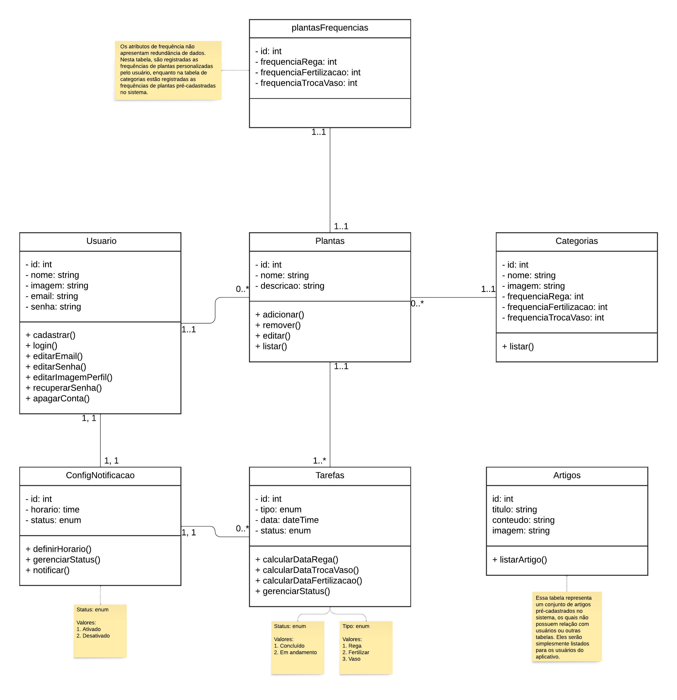
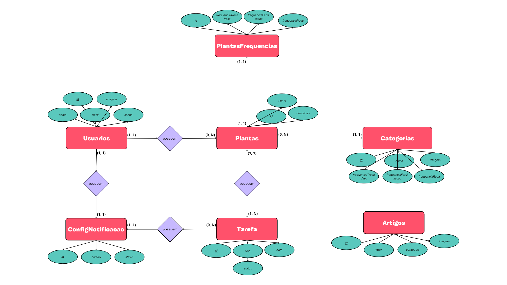
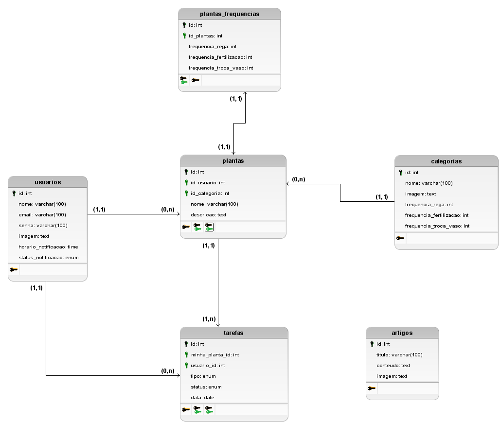

# Arquitetura da Solução

<!-- Pré-requisitos: <a href="3-Projeto de Interface.md"> Projeto de Interface</a> -->

Definição de como o software é estruturado em termos dos componentes que fazem parte da solução e do ambiente de hospedagem da aplicação.

<!--  -->

## Diagrama de Classes

O diagrama de classes ilustra graficamente como será a estrutura do software, e como cada uma das classes da sua estrutura estarão interligadas. Essas classes servem de modelo para materializar os objetos que executarão na memória.

|  |       
| :-------------------------------------------------------------: |  
|                      Diagrama de classes           |

<!-- As referências abaixo irão auxiliá-lo na geração do artefato “Diagrama de Classes”.

> - [Diagramas de Classes - Documentação da IBM](https://www.ibm.com/docs/pt-br/rational-soft-arch/9.6.1?topic=diagrams-class)
> - [O que é um diagrama de classe UML? | Lucidchart](https://www.lucidchart.com/pages/pt/o-que-e-diagrama-de-classe-uml) -->

## Modelo ER

O Modelo ER representa através de um diagrama como as entidades (coisas, objetos) se relacionam entre si na aplicação interativa.

|  |       
| :-------------------------------------------------------------: |  
|                      Diagrama entidade relacionamento           |

<!-- As referências abaixo irão auxiliá-lo na geração do artefato “Modelo ER”.

> - [Como fazer um diagrama entidade relacionamento | Lucidchart](https://www.lucidchart.com/pages/pt/como-fazer-um-diagrama-entidade-relacionamento) -->

## Esquema Relacional

O projeto da base de dados corresponde à representação das entidades e relacionamentos identificadas no Modelo ER, no formato de tabelas, com colunas e chaves primárias/estrangeiras necessárias para representar corretamente as restrições de integridade.

|  |       
| :-------------------------------------------------------------: |  
|                      Modelo lógico do banco de dados           |
 
<!-- As referências abaixo irão auxiliá-lo na geração do artefato “Esquema Relacional”.

> - [Criando um modelo relacional - Documentação da IBM](https://www.ibm.com/docs/pt-br/cognos-analytics/10.2.2?topic=designer-creating-relational-model) -->

<!-- ## Modelo Físico

Entregar um arquivo banco.sql contendo os scripts de criação das tabelas do banco de dados. Este arquivo deverá ser incluído dentro da pasta src\bd.

## Tecnologias Utilizadas

Descreva aqui qual(is) tecnologias você vai usar para resolver o seu problema, ou seja, implementar a sua solução. Liste todas as tecnologias envolvidas, linguagens a serem utilizadas, serviços web, frameworks, bibliotecas, IDEs de desenvolvimento, e ferramentas.

Apresente também uma figura explicando como as tecnologias estão relacionadas ou como uma interação do usuário com o sistema vai ser conduzida, por onde ela passa até retornar uma resposta ao usuário.

## Hospedagem

Explique como a hospedagem e o lançamento da plataforma foi feita.

> **Links Úteis**:
>
> - [Website com GitHub Pages](https://pages.github.com/)
> - [Programação colaborativa com Repl.it](https://repl.it/)
> - [Getting Started with Heroku](https://devcenter.heroku.com/start)
> - [Publicando Seu Site No Heroku](http://pythonclub.com.br/publicando-seu-hello-world-no-heroku.html) -->

# Qualidade de Software

A qualidade de software é um aspecto crucial no desenvolvimento de qualquer aplicativo. Ela garante que o produto final atenda às expectativas dos usuários e ofereça uma experiência de usuário satisfatória. A norma internacional ISO/IEC 25010 define várias características e subcaracterísticas que contribuem para a qualidade de um produto de software.

Abaixo, apresentamos uma tabela com algumas das características e subcaracterísticas de qualidade de software que consideramos importantes para o nosso projeto, juntamente com a justificativa para a escolha e as métricas detalhadas que usaremos para avaliá-las.

| Característica | Subcaracterística | Justificativa | Métrica |
|----------------|-------------------|---------------|---------|
| Funcionalidade | Adequação         | Para avaliar se o sistema atende bem os requisitos levantados pela equipe. | O software atende os requisitos levantados? |
| Confiabilidade | Maturidade | O software deve ser capaz de evitar falhas resultantes de defeitos no software. | Taxa de falhas por tempo. |
| Confiabilidade | Recuperabilidade  | A equipe considera essa subcaracterística importante, pois muitos dados podem ser perdidos após uma falha do sistema. | Os dados anteriores foram recuperados? |
| Usabilidade    | Apreensibilidade  | A equipe optou por essa subcaracterística para poder entender melhor o quão difícil está para o usuário aprender a usar todas as funcionalidades oferecidas pelo sistema. | O sistema é de fácil entendimento? |
| Eficiência     | Comportamento em relação ao tempo | Por ser um sistema que disponibiliza ferramentas para criação de rotinas com finalidade específica, é extremamente importante a avaliação do tempo quando é requisitado um dado na tela até a visualização. | Tempo médio de resposta do software. |
| Manutenibilidade | Modificabilidade  | A equipe considerou uma subcaracterística importante, pois é uma forma de verificar o quanto o código está sendo escrito com fácil compreensão e o quão fácil será para corrigir um erro ou adicionar uma nova funcionalidade | Quanto tempo levou para analisar e corrigir um erro ou implementar uma mudança? |
| Segurança      | Confidencialidade | Para garantir a proteção de dados sensíveis, essa subcaracterística foi escolhida para avaliação. | O sistema possui alguma violação de dados? Os dados estão criptografados? |
| Portabilidade  | Adaptabilidade    | Para analisar a capacidade do aplicativo se adaptar a diferentes tamanhos de tela, sistemas operacionais e dispositivos. | O aplicativo se adapta bem a diferentes ambientes? |
