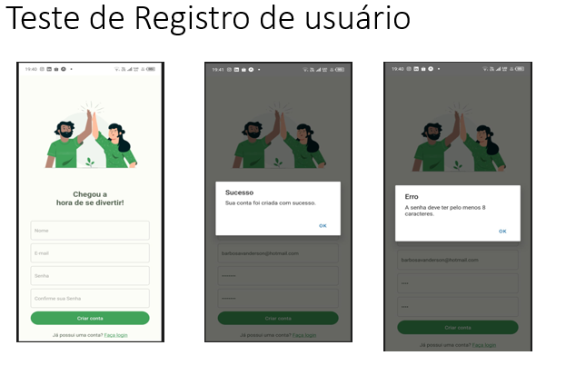
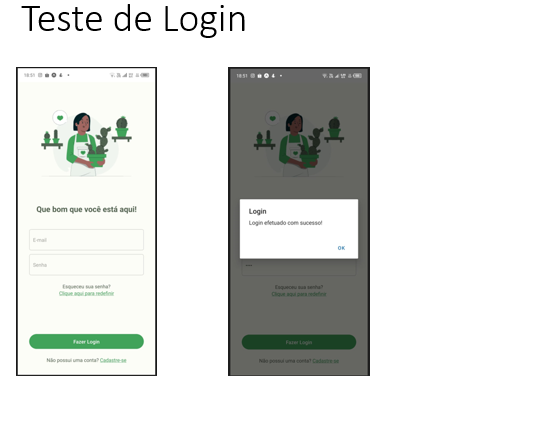
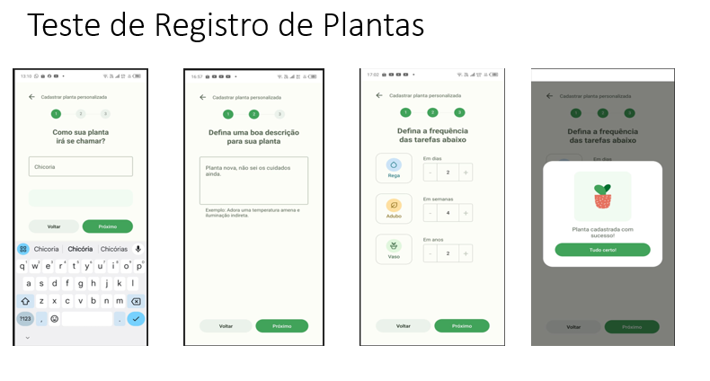
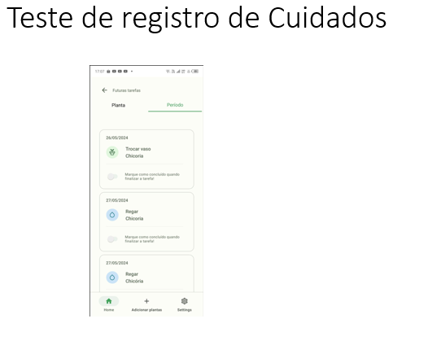
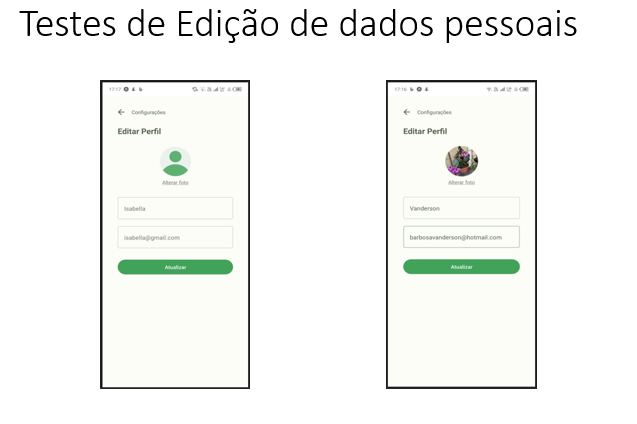
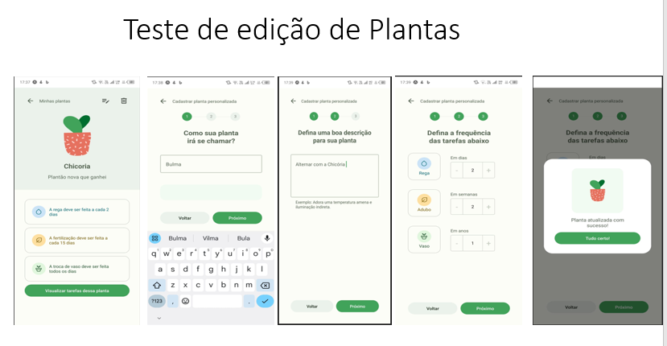

# Registro de Testes de Software
Relatório com os resultados obtidos nos testes de _software_ realizados na aplicação pela equipe, baseado em um plano de testes pré-definido.

## Avaliação

Registro dos Testes

|Caso de Teste |Ação                                 |Resultado Esperado                               |Resultado Obtido                            |
|--------------|-------------------------------------|-------------------------------------------------|--------------------------------------------|
|CT-01         |Cadastro de Usuário                    |Permitir que o usuário se cadastre na plataforma.| A tela de cadastro está funcional, porém a criação do usuário não está integrada ao backend. |
|CT-02         |Login de Usuário                     |Permitir que o usuário faça login na plataforma. | A tela de login está funcional, porém o login não está integrado ao backend. |
|CT-03         |Adição de Plantas   |Permitir que o usuário adicione uma planta. | Resultado alcançado. |
|CT-04         |Exibição de Artigos |Permitir que o usuário exiba artigos. | Resultado alcançado.|
|CT-05         |Edição de Plantas           |Permitir que o usuário edite uma planta. | Resultado alcançado. |
|CT-06         |Validação de Futuras Tarefas    |Permitir o usuário visualize as futuras referentes à planta cadastrada na seção correspondente. | Resultado alcançado. |
|CT-07         |Conclusão de Tarefa                     |Permitir que o usuário conclua uma tarefa. | Resultado alcançado. |
|CT-08         |Edição de Senha |Permitir o usuário edite sua senha. | Resultado alcançado. |
|CT-09         |Edição de Perfil              |Permitir que o usuário edite seu perfil. | Resultado alcançado.|
|CT-10         |Configuração de Lembretes              |Permitir que o usuário atualize as configurações de lembrete. | Resultado não alcançado.|

