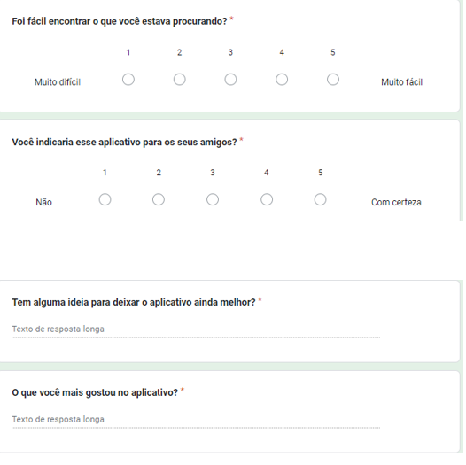
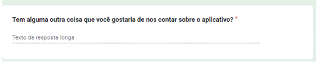

# Registro de Testes de Usabilidade

Os registros a seguir são um relatório com base nas amostras de testes feitos com os participantes baseados no teste de usabilidade.

|Voluntário |Idade|Escolaridade|Ocupação |
|-|-|-|-|
|01|21|Superior incompleto| Estudante de engenharia agronômica|
|02|21|Ensino médio|Estudante|
|03|47|superior|Empreendedor|
|04|65|superior |Aposentada|

Em conformidade com o item 10 "Testes de Usabilidade", executaremos os testes na ordem apresentada no referido item, avaliando os seguintes critérios:

- Termino da tarefa: Será verificado se o usuário consegue concluir a tarefa proposta com sucesso, e se possui alguma dificuldade.
- Quantidade de erros: Será contabilizado o número de erros cometidos pelo usuário durante a execução da tarefa.

Teste 01 - Registro de Usuário
> A tela de cadastro está funcional, porém a criação do usuário não está integrada ao backend.

|Voluntário|Erros|Dificuldade|
|-|-|-|
|01|-|Nenhuma dificuldade observada|
|02|-|Nenhuma dificuldade observada|
|03|-|Nenhuma dificuldade observada|
|04|-|Nenhuma dificuldade observada|

Teste 02 - Login	
> A tela de cadastro está funcional, porém  não está integrada ao backend.

|Voluntário|Erros|Dificuldade| 
|-|-|-|
|01|-|Nenhuma dificuldade observada|
|02|-|Nenhuma dificuldade observada|
|03|-|Nenhuma dificuldade observada|
|04|-|Nenhuma dificuldade observada|

Teste 03 - Registro de Planta
|Voluntário|Erros|Dificuldade| 
|-|-|-|
|01|0|Nenhuma dificuldade observada|
|02|0|Nenhuma dificuldade observada|
|03|0|Nenhuma dificuldade observada|
|04|0|Nenhuma dificuldade observada|

Teste 04 - Registro de Rotina de Cuidado
|Voluntário|Erros|Dificuldade| 
|-|-|-|
|01|0|Nenhuma dificuldade observada|
|02|0|Nenhuma dificuldade observada|
|03|0|Nenhuma dificuldade observada|
|04|0|Nenhuma dificuldade observada|

Teste 05 - Acesso a Artigos sobre Plantas
|Voluntário|Erros|Dificuldade| 
|-|-|-|
|01|0|Nenhuma dificuldade observada|
|02|0|Nenhuma dificuldade observada|
|03|0|Nenhuma dificuldade observada|
|04|0|Nenhuma dificuldade observada|

Teste 06 - Edição de Dados Pessoais
|Voluntário|Erros|Dificuldade| 
|-|-|-|
|01|0|Nenhuma dificuldade observada|
|02|0|Nenhuma dificuldade observada|
|03|0|Nenhuma dificuldade observada|
|04|0|Nenhuma dificuldade observada|

Teste 07 - Recuperação de Senha
> A tela de recuperação de senha está funcional, porém não está integrada ao backend.

|Voluntário|Erros|Dificuldade| 
|-|-|-|
|01|0|Nenhuma dificuldade observada|
|02|0|Nenhuma dificuldade observada|
|03|0|Nenhuma dificuldade observada|
|04|0|Nenhuma dificuldade observada|

Teste 08 - Notificação de Cuidado
> Tela e funcionalidade não foram implementadas.

|Voluntário|Erros|Dificuldade| 
|-|-|-|
|01|0|-|
|02|0|-|
|03|0|-|
|04|0|-|

Teste 09 - Edição de Plantas Cadastradas
|Voluntário|Erros|Dificuldade| 
|-|-|-|
|01|0|Nenhuma dificuldade observada|
|02|0|Nenhuma dificuldade observada|
|03|0|Nenhuma dificuldade observada|
|04|0|Nenhuma dificuldade observada|

Teste 10 - Teste de Navegação
|Voluntário|Erros|Dificuldade|
|-|-|-|
|01|0|Nenhuma dificuldade observada|
|02|0|Nenhuma dificuldade observada|
|03|0|Nenhuma dificuldade observada|
|04|0|Nenhuma dificuldade observada|

# Pesquisa da satisfação

