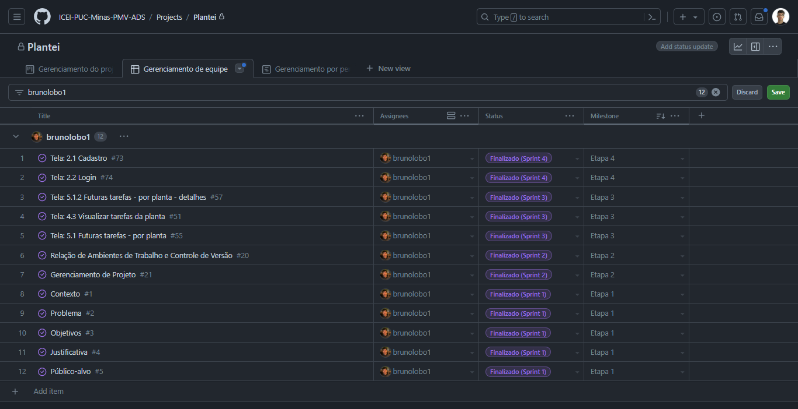
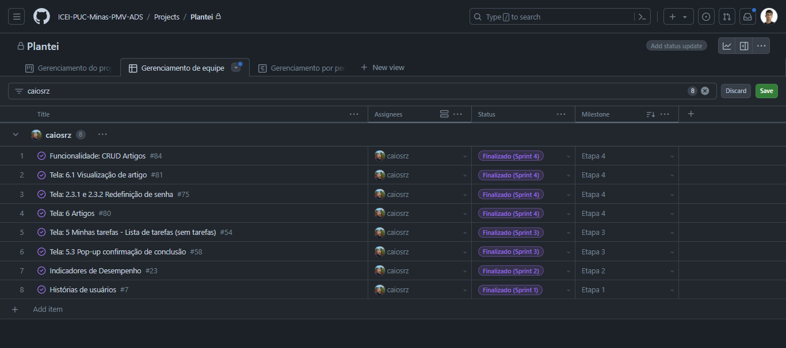
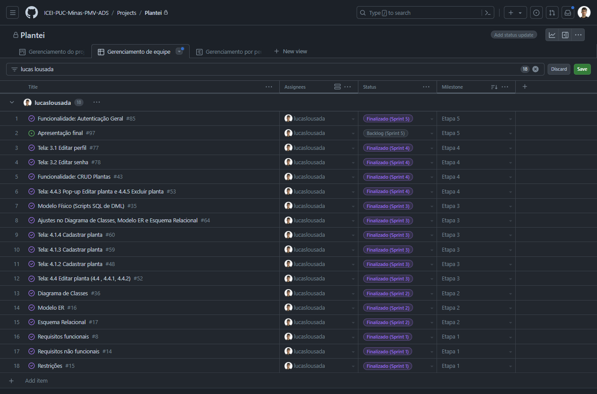
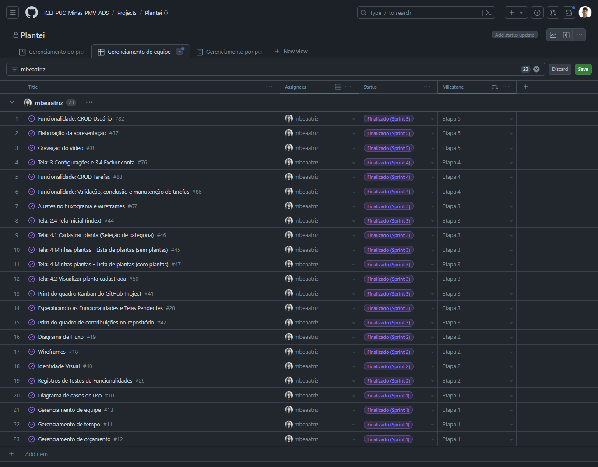
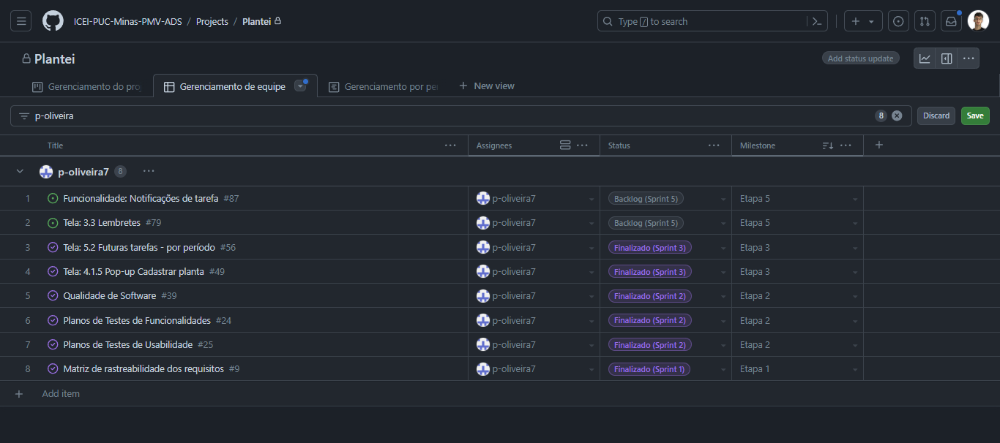
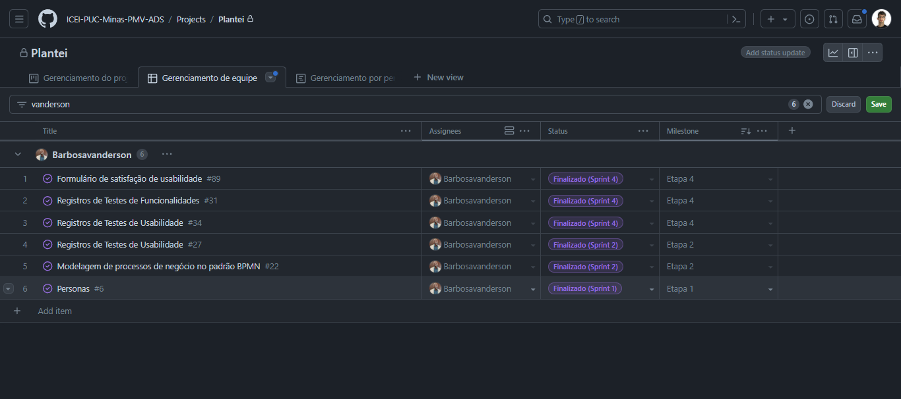
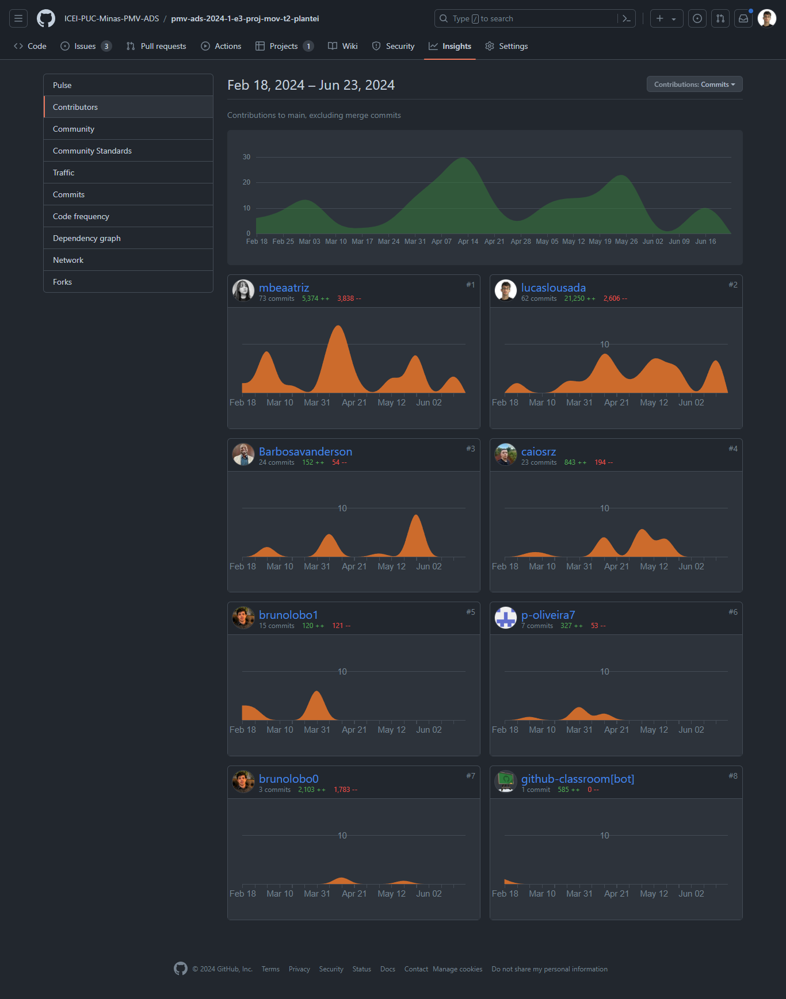

# Considerações finais

## Avaliação das tecnologias utilizadas

O <u>React Native</u> foi escolhido para o desenvolvimento do aplicativo devido à sua capacidade de criar aplicativos para iOS e Android a partir de um único código-base. Além disso, a reutilização de código através da componentização resulta em uma eficiência de desenvolvimento notável. Outro motivo foi o apoio contínuo do Facebook e a presença ativa da comunidade de desenvolvedores, que oferece uma ampla gama de bibliotecas, ferramentas e recursos para auxiliar no desenvolvimento e resolver problemas comuns.

O <u>Expo</u> foi utilizando no projeto por facilitar o desenvolvimento de aplicativos React Native ao fornecer uma série de ferramentas e serviços prontos para uso, reduzindo a complexidade do processo de configuração inicial. Escolhendo o expo, a equipe de desenvolvimento pôde aproveitar a rapidez na configuração do ambiente de desenvolvimento, economizando tempo e permitindo um início rápido no projeto. Além disso, o Expo oferece uma biblioteca de componentes UI prontos para uso, chamada Expo SDK, que inclui uma variedade de componentes pré-construídos e personalizáveis, como câmera, mapas, e notificações push. Isso acelerou o desenvolvimento de funcionalidades comuns em aplicativos móveis, permitindo que os desenvolvedores se concentrassem mais na lógica de negócios do aplicativo.

Como o aplicativo é um projeto acadêmico focado no aprofundamento da tecnologia React Native durante o semestre, optamos por utilizar tecnologias de "mock server", especificamente o <u>JSON Server</u>, para simular recursos de uma API RESTful. Isso permitiu que a equipe de desenvolvimento se concentrasse exclusivamente nas tecnologias diretamente relacionadas ao React Native, como o Expo, proporcionando um aprendizado mais aprofundado dessas ferramentas.

Além disso, utilizamos outras tecnologias e pacotes dentro do ecossistema React, como para o tratamento de formulários, componentes prontos com foco em acessibilidade, e a biblioteca Axios para requisições HTTP, entre outras tecnologias.

## Análise do projeto

### Projeto arquitetural

Ao analisar as necessidades do aplicativo, a equipe de desenvolvimento optou por utilizar a arquitetura cliente-servidor. Isso possibilitou separar as responsabilidades entre o cliente, utilizando React Native, e o servidor, utilizando JSON Server, o que facilitou o desenvolvimento, a manutenção e a escalabilidade do aplicativo.

### Análise e desenvolvimento do projeto

Durante o decorrer do projeto, a equipe precisou realizar alterações no modelo lógico do banco de dados para adequá-lo às regras de negócio da aplicação. Além disso, foi necessário simplificar funcionalidades relacionadas aos usuários e às notificações.

## Proposta de melhorias

Foi concluído que adicionar mais plantas ao catálogo, juntamente com artigos informativos adicionais, permitiria que o projeto atingisse as necessidades de diferentes tipos de usuários. Também se mostrou interessante adicionar mais funcionalidades para os usuários, como a capacidade de editar sua foto de perfil. Por fim, considerou-se a criação de um backend e um banco de dados real para que o projeto possa ser hospedado e começar a formar uma pequena base de usuários para obter feedback.

## Gestão de trabalho do time - GitHub Project

A seguir, apresentamos um retrato atual de cada membro da equipe quanto à gestão visual do trabalho no GitHub e às suas respectivas responsabilidades/atribuições.

|  |
| :---------------------------------------------------------------------------------------: |
|                      *Figura 1 - Responsabilidades Bruno da Silva*                      |

|  |
| :---------------------------------------------------------------------------------------: |
|                      *Figura 2 - Responsabilidades Caio César*                      |

|  |
| :---------------------------------------------------------------------------------------: |
|                      *Figura 3 - Responsabilidades Lucas Lousada*                      |

|  |
| :---------------------------------------------------------------------------------------: |
|                      *Figura 4 - Responsabilidades Maria Beatriz*                      |

|  |
| :---------------------------------------------------------------------------------------: |
|                      *Figura 5 - Responsabilidades Paulo Isidoro*                      |

|  |
| :---------------------------------------------------------------------------------------: |
|                      *Figura 6 - Responsabilidades Vanderson Barbosa*                      |

Por fim, apresenta-se o quadro de contribuições no repositório do GitHub.

|  |
| :---------------------------------------------------------------------------------------: |
|                      *Figura 7 - Quadro de contribuições*                      |
